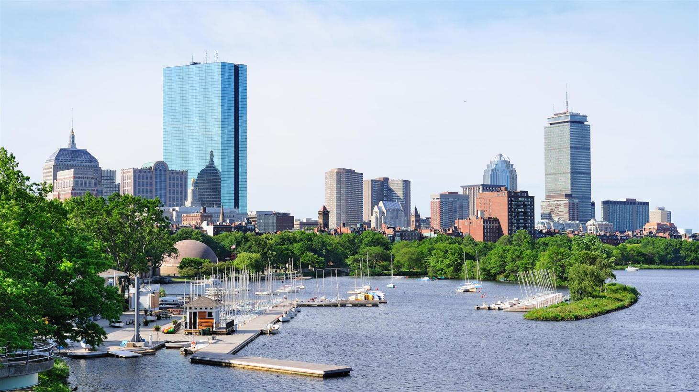

# IBM-Data-Science-Capstone
IBM Data Science Certificate Capstone Project

Boston is one of the oldest municipalities in the United States, founded on the Shawmut Peninsula in 1630 by Puritan settlers from England. Along with its long history, food is a quintessential component of Boston. Cuisine in Boston is similar to the rest of New England cuisine, in that it has a large emphasis on seafood and dairy products. Its best-known dishes are New England clam chowder, fish and chips (usually with cod or scrod), baked beans, lobsters, steamed clams, and fried clams.  

**The objective of this project is to locate and recommend which neighborhood of Boston will be best choice to start a Chinese restaurant and explain the rationale of the recommendations.**

